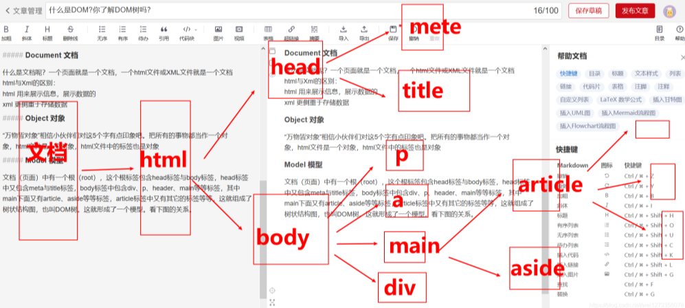
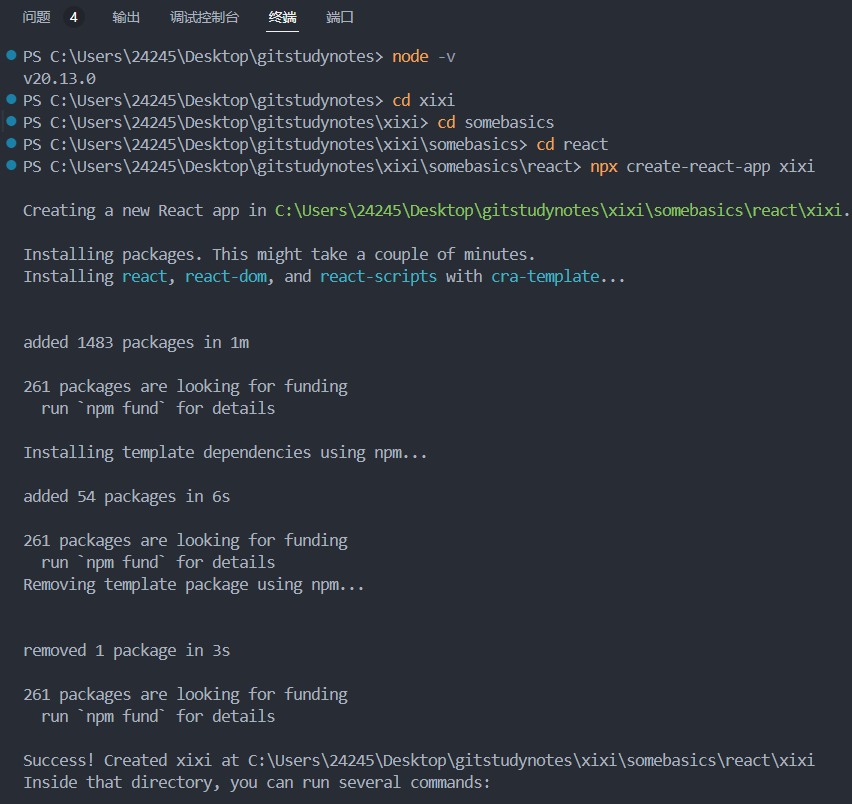
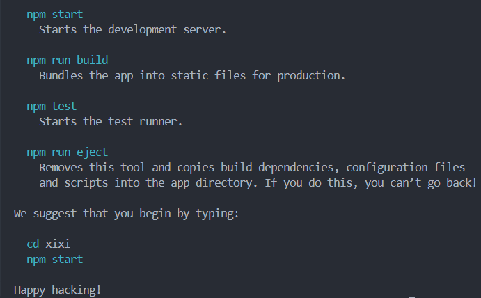

# 1 React起源与发展
React 是由 Facebook 开发的一个用于构建用户界面的 JavaScript 库。它最初由 Jordan Walke 创建，并在 2013 年开源。React 的出现是为了解决在大型应用中管理复杂用户界面的问题，尤其是对频繁变化的数据进行高效渲染。
# 2 React相关基础知识
## 2.1 什么是React
React 是一个用于构建用户界面的 JavaScript 库。与传统的前端开发框架不同，React 采用了**组件化**的开发模式，将页面拆分为一个个独立的组件，**每个组件只负责自身的状态和渲染**。通过这种方式，可以显著提高代码的可复用性和可维护性。
## 2.2 组件（Components）
组件（Components）是一些可重用和可组装的软件或硬件元素，用于构建更大的系统或应用程序。在软件工程中，组件通常是指独立的部分，可以与其他组件结合来完成特定的功能。例如，在网页开发中，HTML、CSS 和 JavaScript 可以被看作是组件，它们可以独立编写后组合成一个完整的网页。在硬件领域，组件可以是电路板上的一个芯片或模块，用于实现特定的功能。  组件是 React 的旗舰功能。其核心思想基于一个简单的策略：分而治之。如果一个问题作为一个整体很难理解透彻和解决，我们就把它拆分为多个小问题，各个击破，最后再将结果综合起来。  
组件是 React 的核心概念之一。它们可以是类组件（class components）或函数组件（function components），但无论是哪种形式，组件都是可重用的、自包含的模块。 
## 2.3 DOM
当你将一个网址输入浏览器的时候，你的电脑和远方的另一台电脑就开始对话。这台远方的电脑一般被称之为服务器。你的电脑发出请求，向服务器索取某种信息，服务器随即做出应答；服务器的应答数据主要包括了三个部分：HTML、CSS 和 JavaScript。
HTML 列举出一个网页的内容并描述其结构。例如，页面上有多少个标题和段落？给用户显示什么图片？这个按钮和那个文本输入框是不是应该放到同一个容器里？
利用 HTML 里的信息，浏览器将会创建一个叫做 DOM 的家伙。  
***
DOM是文档对象模型，是W3C制定的标准接口规范，是一种处理HTML和XML文件的标准API。DOM提供了对整个文档的访问模型，将文档作为一个树形结构，树的每个结点表示了一个HTML标签或标签内的文本项。DOM树结构精确地描述了HTML文档中标签地相互关联性。将HTML或XML文档转化为DOM树地过程称为解析（parse）。HTML文档被解析之后，转化为DOM树，因此对HTML文档地处理可以通过对DOM树的操作实现。DOM模型不仅描述了文档的结构，还定义了结点对象的行为，利用对象的方法和属性，可以方便的访问、修改、添加和删除DOM树的结点和内容。（其余相关知识点在《如何对批量网站进行自动化测试》的5.1章节）    
我们经常希望一个网页是动态和交互式的，也就是说，网页的内容会不时发生变化。程序员们使用 JavaScript 书写代码来向 DOM API 下达命令，于是，网页内容便随着 DOM 的更改而发生变化。随着人们对web应用的强交互性、响应速率有更高的需求，web开发因此越来越复杂，直接与DOM对话的方式就显得繁琐且低效。于是人们开始寻找更高效、更便捷的方法--React（与主题呼应上了） React 充当起了程序员的代言人。他让程序员与DOM之间的沟通变得无比顺畅，将编代码的过程管理得井井有条。

 
## 2.4 声明式用户界面（Declarative UI）
当直接操作 DOM API 时，我们需要明确写出在具体什么时刻、以何种顺序来修改哪个元素。而且因为我们编写的应用是动态的，我们希望DOM能够快速的动态的变化，于是我们可以把很多帧的状态递给React，它就像播放器那样一帧一帧进行播放，一个动态的用户界面就产生了。  
用技术术语来讲，如果一段代码定义的是如何做一件事的步骤，我们称之为命令式；相反，如果定义的是我们所预期的最终结果，它就是声明式。直接操作 DOM API 的传统 web 开发方式是命令式，而 React 是声明式。
## 2.5 虚拟 DOM（Virtual DOM）
虚拟 DOM 是 React 的一个重要特性。它是一种轻量级的表示，用于优化实际 DOM 的更新。React 使用虚拟 DOM 来追踪状态变化，并通过高效的差异算法（diffing algorithm）来最小化实际 DOM 的更新。    
React拿到改过的代码（一个虚拟DOM）后，（与DOM对比）整理归类、删除重复的部分，然后把要改的地方提交给DOM，如此节省了大量时间和资源；  
操作虚拟 DOM 比操作正常的 DOM 要快捷很多，程序员们大部分时候都是在跟虚拟 DOM 打交道，由 React 来代理管理那缓慢的 DOM。  
## 2.6 响应式 DOM 更新（Reactive DOM updates）
我们写程序时只需要将原始数据与相应界面元素关联好，就不需要再做任何后续干涉。当数据发生变化时，React 将自动对相关 DOM 元素做相应的调整。这样看起来就像是 DOM 响应了数据变化（的号召）而自发地做出更改，我们并不需要手动跟踪数据的变化，也不需要担心何时去更改 DOM（实质上是 React 代劳）。这就是响应式（reactive）界面开发方法。这个点子极大地简化了用户界面的开发工作。  
就是一个设定好留白的动态变化，该变化与用户的操作关联。
# 3 创建一个简单的React App
## 3.1 前提需要
- 用VScode
- 安装好node.js（帮助创建和运行reactapp）
- 检查是否安装好：在terminal中运行node -v,如果顺利看到版本号，就是完成了（没有安装就先安装）
- 接下来就可以创建React App了
## 3.2 创建React App
- 随便起一个项目名称，就叫xixireact吧，terminal代码这样：`npx create-react-app xixireact`(注意，这个代码只有安装好node.js才能运行,还有要注意创建项目其实是一个文件夹，该地址不能有同名的文件夹，否则会失败喔)  
  

- 新生成了一个xixireact文件夹，这个就是新创建的项目，打开就可以看到这个项目里的所有文件
- 简单介绍一下：  
    node_modules中包含所有项目运行所需要的三方代码库，通常是不需要管的  
    public里是最后打包好的网站代码  
    src是source的简称，里面包含项目的源代码  
    package.json和package-lock.json是这个项目的配置文件  
    最后reademe是说明文档
## 3.3 本地启动运行
- 先进入到项目中`cd xixireact`  
- 运行项目`npm start`
- 运行完自动会打开一个localhost:3000就可以看到app内容

### 3.3.1这里看一下遇到的bug和解决方法
- 运行`npm start`的时候运行失败`Cannot find module 'ajv/dist/compile/codegen`  
- 解决方案：  
```
npm cache clean --force：清除 npm 缓存。
rm -rf node_modules package-lock.json：删除 node_modules 文件夹和 package-lock.json 文件。
npm install：重新安装所有依赖。
升级 react-scripts 和 ajv 依赖： 有时依赖版本问题会导致兼容性问题，可以尝试升级 react-scripts 和 ajv 到最新版本。执行以下命令：  
npm install react-scripts@latest
npm install ajv@latest
检查 package.json 中的依赖： 打开 package.json，查看 dependencies 中是否明确列出了 ajv，如果有，确保它的版本是最新的。如果没有手动添加，可以尝试安装它：
npm install ajv
检查 npm 和 node 版本： 有时 npm 或 node 版本过旧也可能导致依赖包解析失败。检查你的 npm 和 node 版本：
npm -v
node -v
如果版本过旧，可以尝试升级：
npm install -g npm@latest
如果以上步骤都无法解决问题，可能是项目依赖或设置有问题。你可以尝试删除现有项目并重新创建一个新的 React 项目
```

- 运行网页加载出错`Compiled with problems:×ERROR[eslint] Plugin "react" was conflicted between "package.json » eslint-config-react-app » C:\Users\24245\Desktop\gitstudynotes\xixi\somebasics\react\xixireact\node_modules\eslint-config-react-app\base.js" and "BaseConfig » C:\Users\24245\Desktop\gitstudynotes\xixi\Somebasics\React\xixireact\node_modules\eslint-config-react-app\base.js".`  
- 这个错误是因为在 Windows 系统上，文件路径对大小写不敏感，而你的项目文件夹路径存在大小写不一致的引用（如 somebasics 和 Somebasics）。eslint 在解析这些文件时，认为这些路径不一致，导致冲突错误；解决方案：确保所有文件路径中的大小写保持一致  
```
清除缓存并重新安装依赖： 运行以下命令清除 npm 缓存，并删除 node_modules 文件夹和 package-lock.json，然后重新安装依赖：
npm cache clean --force
rm -rf node_modules package-lock.json
npm install
重新启动开发服务器： 完成路径大小写修复和重新安装依赖后，重新启动开发服务器：
npm start
```
## 3.4 改一个hello world
到xixireact-src-App.js,把header标签中间的默认代码删掉
```
import logo from './logo.svg';
import './App.css';

function App() {
  return (
    <div className="App">
      <header className="App-header">
        <div>Hello World!!</div>
      </header>
    </div>
  );
}

export default App;

```
  

## 3.5 再改一个一个大白菜戴帽子  
xixireact项目  

<video width="320" height="240" controls>
    <source src="../images/react.mp4" type="video/mp4">
</video>


