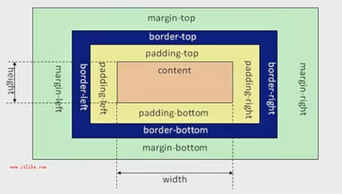

# CSS
- 机构和样式分开，可以最大程度降低代码耦合度，方便后期维护
# CSS样式
CSS指层叠样式表（Cascading Style Sheets），可以一层一层装修网页
## 作用
- 用来美化网页
- HTML用来构建网页整体布局
- CSS用来美化网页，两者缺一不可
## 基础语法
### 一条或多条声明
``` html
<html lang="en">
<head>
    <meta charset="UTF-8">
    <title>河马牙医</title>
    <link rel="shortcut icon" href="favicon.ico" type="image/x-icon"><!--type="image/x-icon"站点图标的类型-->
    <meta name="keywords" content="牙疼怎么办,智齿是什么,拔牙多少钱,矫正多少钱,北大口腔,小白兔牙科">
    <meta name="description" content="有牙齿问题,找河马牙医,儿童口腔,牙疼怎么办,矫正多少钱,种植牙,小白兔牙科">
    <meta name="renderer" content="webkit"/>
    <style><!--!!!!!!-->
        div{
            color:red;
            background-color: blue;
        }
    </style>
```
### 多重声明
```html
<style>
        div{
            color:red;<!--一重-->
            background-color: blue;<!--二重-->
            font-size:20px;<!--三重-->
        }
</style>
```
## CSS样式简介
### 行内样式
（内联式）直接在标签的style属性中书写
### 页内样式
在本网页的style标签中书写（例子就是上面那个代码）
### 外部样式
在单独的CSS文件中书写，然后在网页中用link标签引用
（外部样式创建css文件index.css，内容就style标签里面的东西，引入index.html，在之前\<style>标签的位置改成：\<link rel="stylesheet" href="../index.css">）
- 注意！！！**代码从上往下执行**，就根据最近的执行的变化，优先级也就这样分出来的
## CSS选择器
### 什么是选择器
- 对指定的标签设置样式，要把指定的标签选择出来
### 通用选择器
- 通用选择器可以帮助我们选择页面中所有元素
- 语法：“*{}”
```html
<style>
    *{
        color:purple<!--所有各种标签里面的内容都会变成紫色-->
    }
</style>
```
### 标签选择器
```html
<style>
    <div>{
        color:purple<!--所有<div>标签里面的内容都会变成紫色-->
    }
</style>
```
### 类选择器&id选择器
- 类选择器以一个点号显示： “.center{text-align:center}”
- 只要有同一类名的class都会被选择
- id选择器会对标有特定id的html元素指定特定的样式
- id选择器以“#”定义，**只能独一无二，否则js里面报错**（不独一无二就是class了不可以用id）
```html
<style>
    .p1{color:red}
    .p2{color:green}
    p{color:blue}
    #p3{color:orange}
</style>
<body>
    <p class="p1">我是p1</p><!--red-->
    <p class="p1">我是p1</p><!--red-->
    <p class="p2">我是p2</p><!--green-->
    <p class="p2">我是p2</p><!--green-->
    <p class="p3">我是p3</p><!--blue-->
    <p class="p1 p2">我是p1和p2</p><!--green-->
    <p>没有class的p</p><!--blue-->
    <p id="p3">这是一个带id的</p><!--orange-->
</body>
```
### 复合选择器
- 帮助我们更加精准地拿到对应地标签设置对应地样式
```html
<style>
    div.test1{
        color:red;
    }
    p#p1{
        color:yellow;
    }
</style>
<body>
    <p id="p1">我是p1</p><!--yellow-->
    <div class="p1">我是p1</p>
    <div class="p2">我是p2</p>
    <div class="test1">一个段落</div><!--red-->
</body>
```
### 群组选择器
- 群组选择器也叫并列选择器，可以同时使用多个选择器，多个选择器将被同时应用指定地样式。
- 语法：选择器1，选择器2，选择器3{}
```html
<style>
    div,p,span,.test1,#p1{<!--body里面所有的div标签、p标签、span标签、.test1类别、p1id都是红色-->
        color:red;
    }
</style>
```
### 后代选择器
- html里面就是一个dom树
```html
<!DOCTYPE html>
<html>
    <head>
        <meta charset="UTF-8">
        <title></title>
        <style>
            #main p{<!--id叫main的所有p标签后代-->
                color:red;
            }
        </style>
    </head>
    <body>
        <div id="main">
            <p>div中的p标签</p><!--id叫main的所有p标签后代red-->
            <span>
                <p>span中的p标签</p><!--id叫main的所有p标签后代red-->
            </span>
        </div>
        <p>外面的p标签</p>
    </body>
</html>
```
### 直接后代选择器
- 只要儿子不要孙子
```html
<!DOCTYPE html>
<html>
    <head>
        <meta charset="UTF-8">
        <title></title>
        <style>
            #main > p{<!--id叫main的所有p标签后代-->
                color:green;
            }
        </style>
    </head>
    <body>
        <div id="main">
            <p>div中的p标签</p><!--id叫main的p标签的直接后代green-->
            <span>
                <p>span中的p标签</p>
            </span>
        </div>
        <p>外面的p标签</p>
    </body>
</html>
```
### 兄弟选择器
- 除了根据祖先父子关系，还可以根据兄弟关系查找元素
- 语法：1.查找后边一个兄弟元素：兄弟元素+兄弟元素{}
- 语法：2.查找后边所有兄弟元素：兄弟元素~兄弟元素{}
```html
<!DOCTYPE html>
<html>
    <head>
        <meta charset="UTF-8">
        <title></title>
        <style>
            div+p{
                color:purple;
            }
            div~p{
                color:white;
            }
        </style>
    </head>
    <body>
        <div id="main">
            <p>div中的p标签</p>
            <span>
                <p>span中的p标签</p>
            </span>
        </div>
        <p>外面的p标签</p><!--purple--><!--white-->
        <p>外面的p标签</p><!--white-->
        <p>外面的p标签</p><!--white-->
        <p>外面的p标签</p><!--white-->
        <p>外面的p标签</p><!--white-->
        <p>外面的p标签</p><!--white-->
    </body>
</html>
```
- 代码从上往下执行，当前执行的会覆盖以前的
### 属性选择器
- 用在输入框比较多
- 属性选择器可以挑选带有特殊属性的标签
- 语法：
1. [属性名]
2. [属性名="属性值"]
3. [属性名~="属性值"]
4. [属性名|="属性值"]
5. [属性名$="属性值"]
6. [属性名*="属性值"]
```html
<!DOCTYPE html>
<html>
    <head>
        <meta charset="UTF-8">
        <title></title>
        <style>
            div[name]{<!--先定位到div标签，再找其中属性是name的-->
            background-color:skyblue;
            }
            div[name="main"]{
                color:red;
            }
            div[name][page]{
                color:goldenrod;
            }
        </style>
    </head>
    <body>
        <div name="main"><!--属性就是name,属性值就是main--><!--background-color:skyblue--><!--red-->
            div中
        </div>
        <div name="title" page="66">标题</div><!--background-color:skyblue--><!--goldenrod-->
        <div>外面</div>
    </body>
</html>
```
**总结：","就是or，没有符号就是and**
### 伪类和伪元素（针对特殊使用场景）
#### 使用场景：
- 有时候你需要选择本身没有标签，但是仍然易于识别的网页部位，比如段落首行或鼠标进入等等
- 伪类是单“：”开头，伪元素是双“：：”开头
#### 针对a标签：
- 正常链接“a:link”;
- 访问过的链接“a:visited(只能定义字体颜色)”；
- 鼠标滑过的链接“a:hover”;
- 正在点击的链接：“a:active”
#### 针对其他标签：
- 获取焦点“:focus”
- 指定元素前“:before”
- 指定元素后“:after”
- 选中的元素“::selection”
- 首字母“:first-letter”
- 首行“:first-line”
- 选择第一个子标签“:first-child”
- 选择最后一个子标签“:last-child”
- 选择指定位置的子元素“:nth-child”
```html
<!DOCTYPE html>
<html>
    <head>
        <meta charset="UTF-8">
        <title></title>
        <style>
            p{
                width:300px;
                background-color:red;
            }
            p::first-letter{
                font-size:30px;
                color:green;
            }
            p::first-line{
                color:yellow;
            }
            p.test1:hover{<!--鼠标扫到这个地方的时候发生变化-->
                width:600px;
                background-color:deepskyblue;
            }
            input:focus{
                width:500px;
                height:50px;
            }
        </style>
    </head>
    <body>
        <p class="test1">一个段落一个段落一个段落一个段落一个段落一个段落一个段落一个段落一个段落一个段落一个段落一个段落一个段落一个段落一个段落一个段落一个段落一个段落一个段落一个段落一个段落一个段落一个段落一个段落一个段落一个段落一个段落一个段落一个段落一个段落一个段落一个段落一个段落一个段落一个段落</p>
        <p>一个段落一个段落一个段落一个段落一个段落一个段落一个段落一个段落一个段落一个段落一个段落一个段落一个段落一个段落一个段落一个段落一个段落一个段落一个段落一个段落一个段落一个段落一个段落一个段落一个段落一个段落一个段落一个段落一个段落一个段落一个段落一个段落一个段落一个段落一个段落</p>
        <p>一个段落一个段落一个段落一个段落一个段落一个段落一个段落一个段落一个段落一个段落一个段落一个段落一个段落一个段落一个段落一个段落一个段落一个段落一个段落一个段落一个段落一个段落一个段落一个段落一个段落一个段落一个段落一个段落一个段落一个段落一个段落一个段落一个段落一个段落一个段落</p>
        <input type="text">
    </body>
</html>
```
### 否定伪类
- 否定伪类可以帮助我们选择不是其他标签的某个标签
- 语法：“:not(选择器){}”
- 比如div:not(.box)表示选择所有的div元素但是class为box的除外
```html
<!DOCTYPE html>
<html>
    <head>
        <meta charset="UTF-8">
        <title></title>
        <style>
            div:not(.box){
                color:red;
            }
        </style>
    </head>
    <body>
        <div>1</div><!--red-->
        <div>2</div><!--red-->
        <div class="box">3</div>
        <div>4</div><!--red-->
        <div>5</div><!--red-->
        <div>6</div><!--red-->
        <div>7</div><!--red-->
        <div>8</div><!--red-->
    </body>
</html>
```
## 选择器的优先级别
- 虽然代码从上往下执行，但存在一些特殊的优先级别
- important>内联>id选择器>类选择器>标签选择器>*>继承
## 总结：1.选择器的针对性越强，它的优先级越高
## 总结：2.选择器的权值；原则：选择器的权值加在一起，大的优先，如果权值相同从上到下执行
- *：0
- 标签：1
- 类：10
- 属性：10
- 伪类/伪元素：10
- id:100
- important:1000
# 标签元素划分
## 块元素
特点:
- 自己单独占一行，就像一个段落，随时设置宽度和高度
- 常见块元素：ul;li;form;h1-h6;hr;p;div
## 内联（行内）元素
特点：
- 不会自己独立占一行，就好像一个单词，一直往后排，宽度高度内边距外边距都不可改变
- 常见内联元素：a;big;br;em;img;label;span;
## 内联（行内）-块级元素
特点：
- 多个内联（行内）块级元素可以在一行，能设置宽度和高度
- 常见的内联块级元素：input;select;textarea;
## 块元素与内联元素相互转换
```html
<!DOCTYPE html>
<html>
    <head>
        <meta charset="UTF-8">
        <title></title>
        <style>
            div{
                display:none;<!--div标签及内容不显示-->
            }
            p{
                color:purple;
                display:inline;<!--块标签转为行内标签-->
            }
            a{
                background-color:skyblue;
                display:block;<!--行内标签转为块级标签-->
            }
        </style>
    </head>
    <body>
        <div>2</div><!--不可见-->
        <p>外面的p标签</p><!--行内不换行-->
        <p>外面的p标签</p><!--行内不换行-->
        <a>1</a><!--单独成行换行-->
        <a>1</a><!--单独成行换行-->
    </body>
</html>
```
# 块属性
## 盒子模型
### 基本概念
- 网页上地每个标签都是一个盒子
- 每个盒子都有四个属性
1. 内容（content）：盒子里装地东西；网页中通常是指文字和图片；
2. 填充（padding，内边距）：怕盒子里装的（贵重）东西损坏，而添加的泡沫或其他抗震的辅料
3. 边框（border）:盒子本身
4. 边界（margin,外边距）：盒子摆放的时候不能堆叠在一起，盒子之间要留一定的空隙保持通风；同时也为了方便取出；
### 标准的盒子模型

### IE盒子模型

## 常用属性
### 内容
- height 设置元素高度
- max-height 设置元素的最大高度
- max-width 设置元素的最大宽度
- min-height 设置元素的最小高度
- min-width 设置元素的最小宽度
- width 设置元素的宽度
### 内边距
“padding”在一个声明中设置所有内边距属性：
- 例1：padding:10px 5px 15px 20px(上内边距是10px,右内边距是5px，下内边距是15px，左内边距是20px)
- 例2：padding:10px 5px 15px(上内边距10px，右内边距是5px，下内边距是15px，左内边距是5px)
- 例3：padding:10px 5px（上内边距和下内边距是10px，右内边距和左内边距是5px）
- 例4：padding:10px(所有4个内边距都是10px)
“padding-bottom”设置元素的下内边距
“padding-left”设置元素的左内边距
“padding-right”设置元素的右内边距
“padding-top”设置元素的上内边距
```html
<style>
    #box{
        padding-left:20px;
        padding-top:30px;
        padding-right:50px;
        padding-bottom:10px;
        <!--等价于-->
        padding:30px 50px 10px 20px;
    }
</style>
```
### 边框
设置4个边框的样式：
border简写属性在一个声明设置所有的边框属性，可以按照顺序设置如下属性：
border所有边框
border-top上边框
border-right右边框
border-bottom下边框
border-left左边框

border-width边框宽度
border-style边框格式，solid实线，dashed虚线,double双线
border-color边框颜色
border-redius边框圆角
border-redius:50%圆形
border-top-left-redius:左上角边框圆角
```html
p{
    border:5px solid red;
}
```
### 外边距
- 例1：margin:10px 5px 15px 20px;上外边距10px；右外边距5px；下外边距：15px；左外边距20px；
- 例2：margin:10px 5px 15px;上外边距10px；右外边距5px；下外边距15px;左外边距5px;
- 例3：margin:10px 5px;上外边距和下外边距10px;右外边距和左外边距px;
- 例4：margin:10px;所有4个外边距都是10px；
# 浮动
## 为什么要有浮动
两个块级元素都设置了宽度和高度，两个想要占一行，就使用浮动来进行设置
```html
<!DOCTYPE html>
<html>
    <head>
        <meta charset="UTF-8">
        <title></title>
        <style>
            #box{
                width:80%;
                height:400px;
                background-color:red;
            }
            .test1{
                background-color:#0c80dc;
                float:left;
            }
            .test2{
                background-color:greenyellow;
                float:right;
            }
        </style>
    </head>
    <body>
        <div id="box">
            <div class="test1">第一个</div>
            <div class="test2">第二个</div>
    </body>
</html>
```
# 标签居中
## 水平居中
行内标签：
- 行内-块级标签：text-align:center
- 块级标签：margin:0 auto
## 垂直居中
- line-height:300px（在300p区间内垂直居中）
- 定位，绝对与相对
- 多标签图片等行内的，要对齐，可以用：vertical-align:middle;
# 河马牙医案例
```html
<html lang="en">
<head>
    <meta charset="UTF-8">
    <title>河马牙医</title>
    <link rel="shortcut icon" href="favicon.ico" type="image/x-icon"><!--type="image/x-icon"站点图标的类型-->
    <meta name="keywords" content="牙疼怎么办,智齿是什么,拔牙多少钱,矫正多少钱,北大口腔,小白兔牙科">
    <meta name="description" content="有牙齿问题,找河马牙医,儿童口腔,牙疼怎么办,矫正多少钱,种植牙,小白兔牙科">
    <meta name="renderer" content="webkit"/>
    <style>
        #header{
            height: 80px;
        }
        #header .header-center{
            width: 1260px;
            height: 80px;
            margin: 0 auto;
        }
        .header-c-left{
            float:left;
            height: 80px;
            width:450px;
            line-height: 80px;
        }
        .header-c-right{
            float:right;
            height: 80px;
            width:450px;
            line-height: 80px;

        }
        .header-c-right a{
            margin-right: 30px;
            text-decoration: none;
            font-size: 18px;
        }
        .header-c-right a span{
            vertical-align: middle;
        }
        .header-c-right a img{
            vertical-align: middle;
            margin-right: 5px;
        }
        body{
            margin: 0;
        }
        section img{
            width: 100%;
            vertical-align: top;
        }
        #footer{
            height: 30px;
            background-color:#346699;
        }
        #footer .footer-center{
            width: 1260px;
            height: 30px;
            margin: 0 auto;
            line-height: 30px;
        }
        #footer .footer-center p{
            margin-top: 0;
            text-align: right;
        }
        #footer .footer-center p span{
            margin-right: 5px;
            font-size: 12px;
            color: white;
        }
    </style>
</head>
<body><!--这里有外边距需要清除-->
    <header id="header">
        <div class="header-center">
            <!--头部左边-->
            <div class="header-c-left">
                
            </div>
            <!--头部右边-->
            <div class="header-c-right">
                <a href="#">
                    
                    <span>
                        首页
                    </span>
                </a>
                <a href="#">
                    
                    <span>
                        关于我们
                    </span>
                </a>
                <a href="#">
                    
                    <span>
                        联系我们
                    </span>
                </a>
            </div>

        </div>
    </header>
    <article>
        <!--"section*4"+tab-->
        <!--复制“style="height: 80px;background-color: yellow;”按alt，一个个点一下，粘贴-->
        <section>
            <!--img+tab-->
            
        </section>
        <section>
            
        </section>
        <section>
            
        </section>
        <section>
            
        </section>
    </article>
    
    <footer id="footer">
        <div class="footer-center">
            <p>
                <span>@2024</span>
                <span>上海网络科技有限公司</span>
                <span>19372869</span>
                <span>客服热线：121112</span>
            </p>
    </footer>
</body>

</html>
```